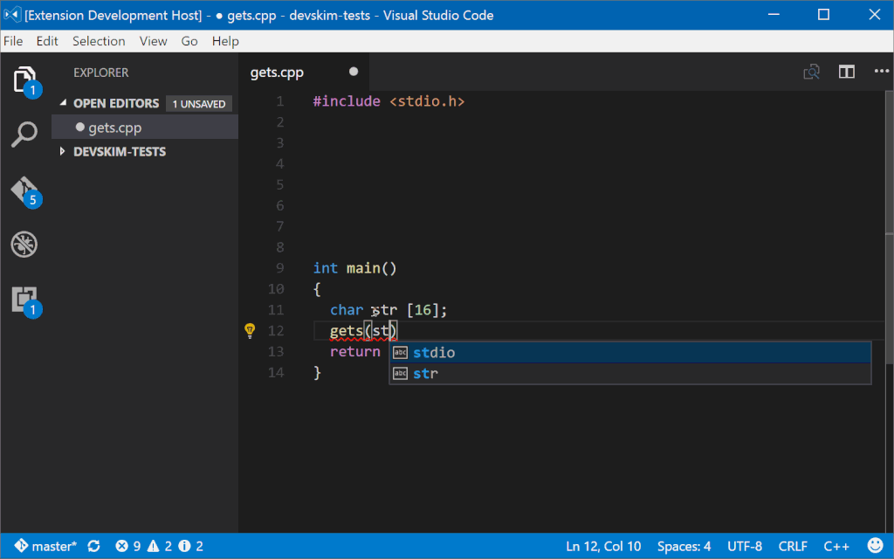

# DevSkim
  

DevSkim is a framework of IDE extensions and language analyzers that provide inline security analysis 
in the dev environment as the developer writes code. It has a flexible rule model that supports multiple programming
languages. The goal is to notify the developer as they are introducing a security
vulnerability in order to fix the issue at the point of introduction, and to help build awareness
for the developer.

### Features

* Built-in rules, and support for writing custom rules
* Cross-platform CLI built on .NET 5.0 for file analysis
* IDE plugins for Visual Studio and Visual Studio Code
* IntelliSense error "squiggly lines" for identified security issues
* Information and guidance provided for identified security issues
* Optional suppression of unwanted findings
* Broad language support including: C, C++, C#, Cobol, Go, Java, Javascript/Typescript, Python, and [more](https://github.com/Microsoft/DevSkim/wiki/Supported-Languages).

### Repository Structure

This repository contains DevSkim and its official supported plugins. Issues and contributions are accepted here for:

* DevSkim Library
  * Location: `./DevSkim-DotNet/`
* DevSkim CLI
  * Location: `./DevSkim-DotNet/Microsoft.DevSkim.CLI/`
* DevSkim Visual Studio Extension
  * Location: `./DevSkim-DotNet/Microsoft.DevSkim.VSExtension/`
* DevSkim Blazor
  * Location: `./DevSkim-DotNet/Microsoft.DevSkim.Blazor/`
* DevSkim Visual Studio Code Plugin
  * Location: `./DevSkim-VSCode-Plugin/`
* Common Rules and Guidance
  * Location: `./rules/default/`

## Official Releases

[DevSkim.Blazor](https://microsoft.github.io/DevSkim/) is available to run in your browser as a Blazor WebAssembly application.

Platform specific binaries of the DevSkim CLI are available on our GitHub [releases page](https://github.com/microsoft/DevSkim/releases).

The C# library is available on NuGet as [Microsoft.CST.DevSkim](https://www.nuget.org/packages/Microsoft.CST.DevSkim/).

The .NET Global Tool is available on NuGet as [Microsoft.CST.DevSkim.CLI](https://www.nuget.org/packages/Microsoft.CST.DevSkim.CLI/).

The Visual Studio extension is available in the [Visual Studio Marketplace](https://marketplace.visualstudio.com/items?itemName=MS-CST-E.MicrosoftDevSkim).

The Visual Studio Code plugin is available in the [Visual Studio Code Marketplace](https://marketplace.visualstudio.com/items?itemName=MS-CST-E.vscode-devskim).

DevSkim is also available as a [GitHub Action](https://github.com/microsoft/DevSkim-Action) to itegrate with the GitHub Security Issues pane.

## Installation

### Visual Studio Extension

The DevSkim Visual Studio extension can be downloaded and installed from the [Visual Studio Marketplace](https://marketplace.visualstudio.com/items?itemName=MS-CST-E.MicrosoftDevSkim).

Alternatively, in Visual Studio, open the Extension Manager (Menu: Extensions -> Manage Extensions), search for "Microsoft DevSkim", select the entry, and click on the Download button.

### Visual Studio Code Plugin

The DevSkim Visual Studio Code plugin can be downloaded and installed from the [Visual Studio Code Marketplace](https://marketplace.visualstudio.com/items?itemName=MS-CST-E.vscode-devskim).

Alternatively,  In VS Code, launch the Quick Open bar (Ctrl + P), and run the following command:
ext install ms-cst-e.vscode-devskim

### .NET Core App (Self Contained)

Download the platform specific binary archive for your system (Windows, Mac OS, Linux) from the [releases page](https://github.com/microsoft/DevSkim/releases). Extract the archive, navigate to the DevSkim folder from a command line, and invoke `devskim` or `devskim.exe`.

### .NET Core Global Tool

If you already have .NET 5.0 installed, you can install the DevSkim CLI dotnet global tool by running the following from a command line:

`dotnet tool install --global Microsoft.CST.DevSkim.CLI`

This will add DevSkim to your PATH. You can then invoke the `devskim` command from a command line.

### .NET Core Runtime Dependent App

First download and install the [.NET Core 5.0 runtime](https://dotnet.microsoft.com/).
Then download the DevSkim netcoreapp archive from the [releases page](https://github.com/microsoft/DevSkim/releases). Extract the archive, navigate to the DevSkim folder from a command line, and invoke `dotnet devskim.dll`.

## Build from Source

For more information, see the wiki page about how to [Build from Source](https://github.com/microsoft/DevSkim/wiki/Build-from-Source).

## Basic Usage

### DevSkim CLI

`devskim analyze c:\path\to\FilesToAnalyze`

For more information, see the wiki page about the [Command Line Interface](https://github.com/microsoft/DevSkim/wiki/Command-Line-Interface).

### Visual Studio Extension / Visual Studio Code Plugin

Once the DevSkim plugin is installed and enabled, simply write some code, and feedback will be provided inline if issues are detected.

## Writing Rules

Please see [Writing Rules](https://github.com/Microsoft/DevSkim/wiki/Writing-Rules) for
instructions on how to author new rules.

## Contributing

This project welcomes contributions and suggestions.  Most contributions require you to agree to a
Contributor License Agreement (CLA) declaring that you have the right to, and actually do, grant us
the rights to use your contribution. For details, visit https://cla.opensource.microsoft.com.

When you submit a pull request, a CLA bot will automatically determine whether you need to provide
a CLA and decorate the PR appropriately (e.g., status check, comment). Simply follow the instructions
provided by the bot. You will only need to do this once across all repos using our CLA.

This project has adopted the [Microsoft Open Source Code of Conduct](https://opensource.microsoft.com/codeofconduct/).
For more information see the [Code of Conduct FAQ](https://opensource.microsoft.com/codeofconduct/faq/) or
contact [opencode@microsoft.com](mailto:opencode@microsoft.com) with any additional questions or comments.

For more information, please see [How to Contribute](https://github.com/Microsoft/DevSkim/wiki/How-to-Contribute).

## Reporting Issues

For more information, please see [How to Contribute](https://github.com/Microsoft/DevSkim/wiki/How-to-Contribute).

### Reporting Security Vulnerabilities

To report a security vulnerability, please see [SECURITY.md](https://github.com/microsoft/DevSkim/blob/master/SECURITY.md).

## License

DevSkim and its official plugins are licensed under the [MIT license](https://github.com/microsoft/DevSkim/blob/master/LICENSE.txt).
